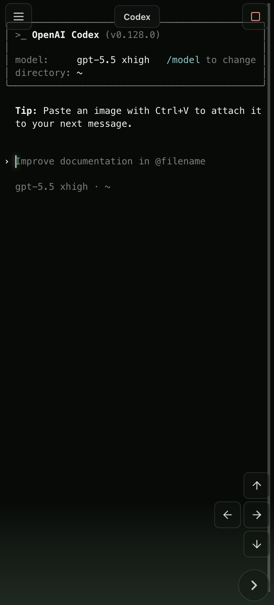
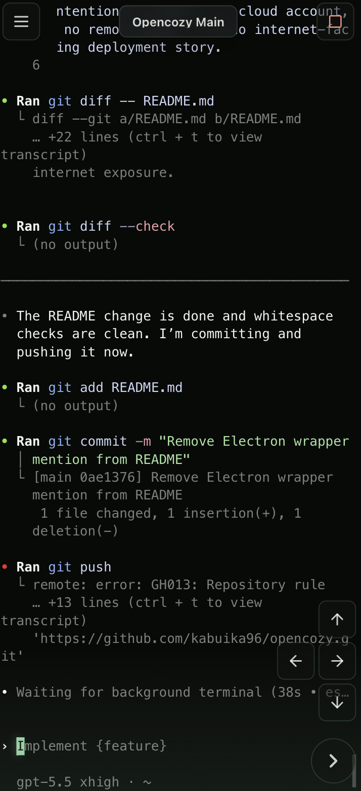

# OpenCozy

OpenCozy is an open-source PWA for using Codex from a phone or tablet while Codex runs on a computer you control.

It starts Codex in a PTY on the Codex Host and streams the terminal into a mobile-friendly browser app. It is intentionally small: no cloud account, no remote shell, and no public internet exposure path.

> Status: early alpha. OpenCozy is for trusted local networks and explicitly enrolled private-network devices, not public internet exposure.

> Agents: start with [AGENTS.md](AGENTS.md). Humans: this README is the map.

## Preview

<p>
  
  
</p>

## Install

OpenCozy has two pieces:

1. **The OpenCozy server** runs on one computer on your LAN. This is where the repo, backend, frontend dev server, and Codex CLI live.
2. **The PWA on your devices** connects to that server. On iPhone or iPad, open the LAN URL in Safari and save it to your Home Screen.

### Give This To Your Agent

OpenCozy is designed to be installed and operated with an AI coding agent. Start by asking your agent to install and run it:

```text
Install and start OpenCozy from GitHub:
https://github.com/kabuika96/opencozy

Please handle the setup end to end:
- Use Node.js 22.12+ and npm 10+.
- Make sure the Codex CLI is installed and authenticated on this computer.
- Clone https://github.com/kabuika96/opencozy.git, or update the existing clone if it is already present.
- Preserve existing data and .env files. Copy .env.example to .env only if .env does not exist.
- Install dependencies with npm.
- Start OpenCozy with npm run dev.
- Do not stop unrelated apps or services. If the default ports are busy, choose free ports and tell me what changed.
- Verify that the backend health endpoint works and that the frontend loads.
- Tell me the local URL, LAN URL, frontend port, backend port, and default Codex working directory.
- Help me connect my phone or tablet with Safari Add to Home Screen.

Useful defaults:
- git clone https://github.com/kabuika96/opencozy.git
- cd opencozy
- npm install
- cp .env.example .env
- npm run dev
```

### Manual Install

```sh
git clone https://github.com/kabuika96/opencozy.git
cd opencozy
npm install
cp .env.example .env
npm run dev
```

Open `http://127.0.0.1:5175`. Vite will also print a LAN URL when one is available.

The frontend proxies API requests and WebSockets to the backend at `http://127.0.0.1:8788`.

On iPhone or iPad:

1. Open the LAN URL in Safari.
2. Tap Share.
3. Tap Add to Home Screen.
4. Launch OpenCozy from the Home Screen icon.

## Requirements

- Node.js 22.12 or newer
- npm 10 or newer
- Codex CLI installed and authenticated on the Codex Host

## Configuration

OpenCozy reads backend runtime configuration from environment variables and from a root `.env` file when it exists. The frontend dev server also reads the root `.env` file.

Start from [.env.example](.env.example):

```sh
cp .env.example .env
```

The most common settings are:

- `OPENCOZY_HOST`: backend listen host. Defaults to `0.0.0.0` for LAN access.
- `OPENCOZY_PORT`: backend API and WebSocket port. Defaults to `8788`.
- `OPENCOZY_FRONTEND_PORT`: Vite frontend port. Defaults to `5175`.
- `OPENCOZY_DB_PATH`: local SQLite state path. Defaults to `./data/opencozy.sqlite`.
- `OPENCOZY_CODEX_BIN`: Codex command or absolute path. Defaults to `codex`.
- `OPENCOZY_CODEX_CWD`: default Codex working directory. Defaults to the OS user's home directory.
- `OPENCOZY_ALLOWED_HOSTS`: optional comma-separated browser-facing hostnames accepted by the frontend and backend origin guard. Include every LAN and private-WAN hostname or IP you intend to use.

## Private WAN Access

The default OSS path is still LAN access. For remote access from your own enrolled devices, use a private device network such as Tailscale and keep OpenCozy behind a tailnet-private HTTPS origin.

Recommended first setup:

- Bind the backend to `127.0.0.1`.
- Serve the Vite frontend as the single OpenCozy origin.
- Put Tailscale Serve in front of that frontend origin with HTTPS.
- Set `OPENCOZY_ALLOWED_HOSTS` to the exact LAN and tailnet hostnames you will open in the browser.
- Do not expose the backend port directly.
- Do not use Tailscale Funnel or another public internet tunnel for OpenCozy.

See [docs/opencozy-local-services.md](docs/opencozy-local-services.md#private-wan-with-tailscale-serve), [docs/private-wan-agent-setup.md](docs/private-wan-agent-setup.md), [SECURITY.md](SECURITY.md), and [ADR 0005](docs/adr/0005-private-wan-through-tailscale-serve.md).

Helpers:

```sh
npm run wan:start
npm run wan:stop
npm run private-wan:doctor
npm run private-wan:serve
npm run private-wan:status
npm run private-wan:stop
```

Use `wan:start` when OpenCozy should be available on both LAN and enrolled Tailscale devices. It starts the local OpenCozy services and then enables Tailscale Serve. Use `private-wan:stop` to disable only the tailnet HTTPS origin, or `wan:stop` to disable the tailnet origin and stop the local OpenCozy services together.

## Durable Local Services

For long-running phone access on macOS, OpenCozy includes optional launchd helpers:

```sh
npm run lan:start
npm run lan:stop
npm run services:install
npm run services:start
```

Do not run `npm run dev` and `npm run services:start` at the same time. Stop the foreground dev runner before enabling durable services, or the default ports will already be occupied.

Frontend changes update through Vite/HMR. Backend changes require a manual restart because the backend owns live Codex PTYs; auto-restarting the backend can interrupt active conversations. See [docs/opencozy-local-services.md](docs/opencozy-local-services.md) for the backend restart policy, status, restart, stop, and log commands.

## Local Data

The repo-level `data/` directory is ignored except for `data/.gitkeep`. It may contain local SQLite state during development.

Do not commit `.env` files, local session databases, Codex conversation output, or machine-specific logs.

## Architecture

The short version:

```text
Phone or tablet browser PWA
  -> React mobile terminal shell
  -> Vite proxy
  -> Node/Fastify backend
  -> Codex-only PTY process
```

See [CONTEXT.md](CONTEXT.md) and the ADRs in [docs/adr](docs/adr) for the project language and scope boundaries.

## Development

```sh
npm run check
npm run test
npm run build
```

See [CONTRIBUTING.md](CONTRIBUTING.md) for local setup, checks, and pull request expectations.

## Security

OpenCozy is designed for trusted local networks or enrolled devices on a private device network. See [SECURITY.md](SECURITY.md) before exposing it beyond your own machine or LAN.

## License

MIT. See [LICENSE](LICENSE).
